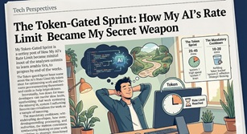

Exploring how a 'Rate Limit Reached' message might be your brain's best opportunity.

### The hidden potential of the break

In the modern discourse of productivity, the "break" is either a waste of productive time or a carrot dangled before the weary laborer. Yet, both views ignores the profound neurological alchemy behind the success of the `Pomodoro Technique` [1],[2]. When one rises from the desk to walk, one does not merely rest; one disengages the "execution" mode of thought.

Execution is, by its nature, a state of blinkered focus (`Large Stakes and Big Mistakes`[3]). It is efficient, but it is narrow. By physically removing oneself from the screen, the brain is liberated from the rigid tracks of linear problem-solving. It is in this state of "wandering" that the gates of creativity swing wide, allowing the subconscious to bridge gaps that the focused mind could not even perceive.

### The Centaur: Biē and Metis for Rapid Prompting

Let's first analyse briefly the new state of work we are exposed to. Probably the most apt analogy that we find ourselves doint "Centaur Work",  a term borrowed from the world of Grandmaster Chess (`Deep Thinking: Where Machine Intelligence Ends and Human Creativity Begins.`[4],[5]). In Centaur Chess, a human player pairs with an AI, combining the machine’s sheer calculative power with human intuition. The usual analogy, is to say  AI serves as our System 1: it is fast, associative, and tireless ( `Thinking fast, thinking slow` [6]).

However this duality (system 1, system 2) is very quickly limiting and we need to go back to classical Greece to find a higher dimensionality when discussing intelligence.

In the lexicon of the ancient Greeks (see Annex 1 or `Cunning Intelligence in Greek Culture and Society` [7]), the AI represents a potent mix of Biē (pure, raw force) and a simulated Mētis (practical, applied intelligence). Every prompt we issue is an unleashing of this force. However, after each output, the human must engage it's own System 2—the slow, deliberate processor—to exercise Phronesis (practical wisdom) and Kairos (the sense of the opportune moment) to decide for the sequence of upcoming prompts. As still to this day most chat agents are linear. We review the machine's "System 1" burst to decide the next right step... Until `rate limit` message comes

### The Rate Limit: From Phronesis to Epistēmē

Many practitioners view the "Rate Limit Reached" message as a catastrophic halt to their productivity. This is a profound misunderstanding. We must not confuse "`Herrings *` Done Faster" with "Getting the Right Thing Done." Speed is a hollow victory if the direction is flawed.

While the brief pause after a single prompt allows for tactical Phronesis, the hit of a rate limit is an invitation to a higher level of thought. It is a forced transition from the "how" to the "why." This is the moment for Epistēmē (scientific, principled knowledge) and Mētron (the sense of right balance and measure).

The rate-limit message, much like the ring of a tomato-shaped timer, is a mandatory pause that allows to go one level deeper than the "Slow Brain", not just to evaluate the progress of the "Fast Machine." It is an opportunity to look at the entire map and assess, with Mētron, if the goal being chased is truly the one that deserves priority. By embracing these technical constraints, we ensure that our "Centaur" does not merely run faster, but runs toward the right horizon. We trade the frantic Biē of the sprint for the deliberate Epistēmē of the marathon, allowing ourselves to pick the right door to be opened next as oppose to throwing the shoulder of your `AI's Hulk` again the next locked door.

`* Red Herrings`, refers to a misleading direction

### Annex 1 - The 7 dimensions for intelligence as seen by Classical Greeks 

|Step in the Process|Greek Intelligence|System 1 / System 2|"Modern Explanation (The ""Expert's Path"")"|
|--|--|--|--|
|1. Framing|Epistémè & Mêtron| - |Identifying when a given model does not apply to the problem at hand|
|2. Direction|Phronèsis| - |"The ""Why"": Defining the moral or strategic goal. System 2 calculates| but Phronèsis chooses the destination."|
|3. Analysis|Logos|System 2 (Slow)|"The ""What"": Breaking down the complex into the simple through logical deduction and formal reasoning."|
|4. Timing|Kairos| - |"The ""When"": The strategic ""gut feel"" for the right moment to pivot from thinking to acting."|
|5. Adaptation|Mètis|System 1 (Fast)|"The ""How"": Expert intuition and tactical fluidity. Using learned patterns to navigate the ""messy"" reality."|
|6. Impact|Biè|Executive Output|"The Force: The final application of energy| budget| or physical power to resolve the obstacle."|

### Select Bibliography & Annotations

[1] Cirillo, F. (2006). The Pomodoro Technique (The Software Design Consulting). Francesco Cirillo Official Manuscript. [Official Web Link](https://www.pomodorotechnique.com/)

[2] Oatley, K. (2011). The Cognitive Science of Fiction and Creativity. Wiley-Blackwell. (Investigating how disengagement and "mind-wandering" facilitate creative breakthroughs.)

[3] [Large Stakes and Big Mistakes](https://doi.org/10.1111/j.1467-937X.2009.00534.x) by Ariely, Dan and Gneezy, Uri and Loewenstein, George and Mazar, Nina in The Review of Economic Studies (2009), 
doi:10.1111/j.1467-937X.2009.00534.x, 

abstract:

> Workers in a wide variety of jobs are paid based on performance, which is commonly seen as enhancing effort and productivity relative to non-contingent pay schemes. However, psychological research suggests that excessive rewards can, in some cases, result in a decline in performance. To test whether very high monetary rewards can decrease performance, we conducted a set of experiments in the U.S. and in India in which subjects worked on different tasks and received performance-contingent payments that varied in amount from small to very large relative to their typical levels of pay. With some important exceptions, very high reward levels had a detrimental effect on performance.

[4] Kasparov, G. (2017). Deep Thinking: Where Machine Intelligence Ends and Human Creativity Begins. PublicAffairs. (The definitive text on the evolution of "Centaur" collaboration between man and machine.)

[5] https://conversationswithtyler.com/episodes/garry-kasparov/

[6] Kahneman, D. (2011). [Thinking, Fast and Slow](https://cdn.penguin.co.uk/dam-assets/books/9780141033570/9780141033570-sample.pdf). Farrar, Straus and Giroux. (On the vital distinction between the rapid, reactive System 1 and the slow, deliberate System 2.)

[7] Detienne, M., & Vernant, J. P. (1991). `Cunning Intelligence in Greek Culture and Society`. University of Chicago Press. (An essential exploration of Mētis as a strategic and practical wisdom.)

